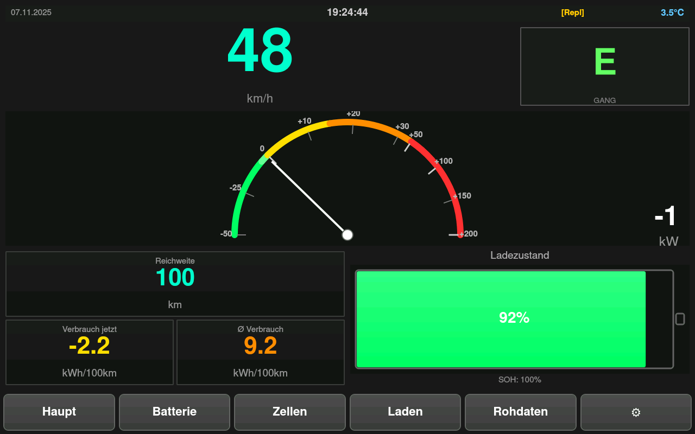
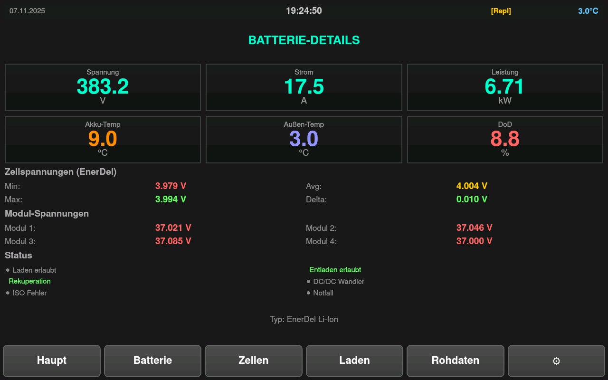
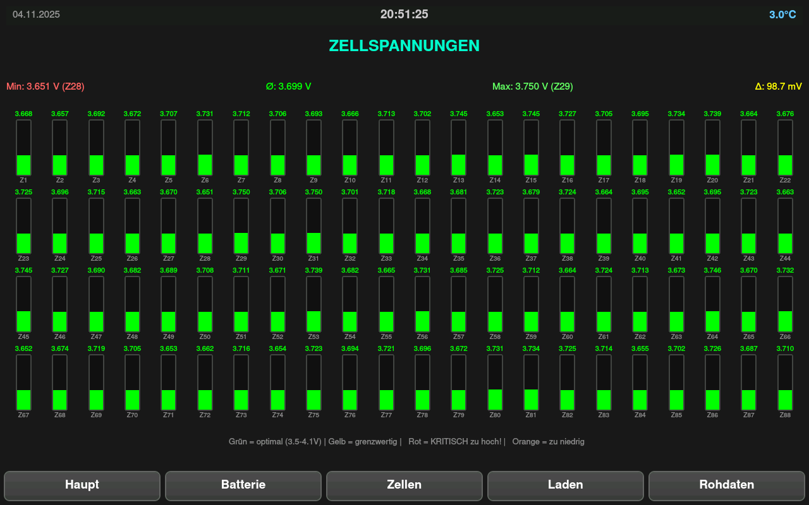
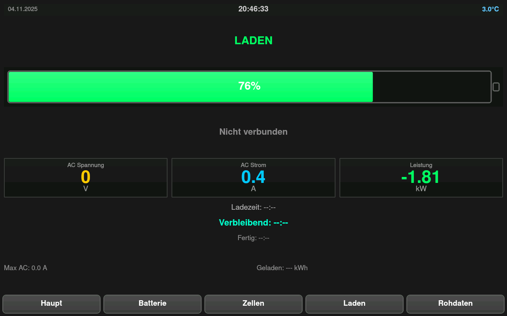
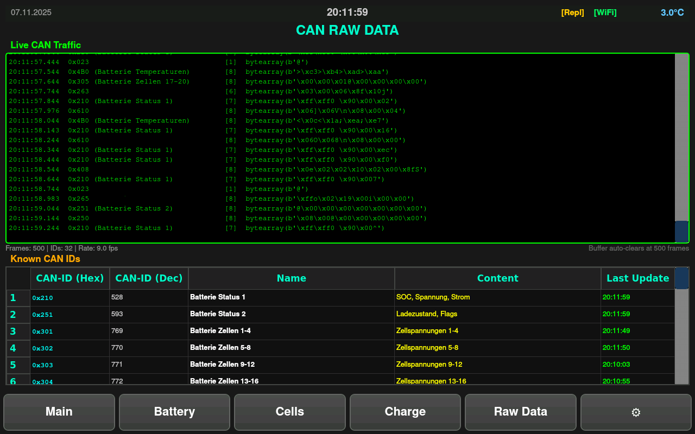

# ThinkCity Dashboard v3

**Modernes PyQt5 Dashboard für Think City Elektrofahrzeuge**  
**Raspberry Pi 4B + HDMI-Touchscreen + MCP2515 CAN**

Ein vollwertiges CAN-Bus Dashboard für den Raspberry Pi mit SunFounder 10" HDMI-Touchscreen und MCP2515 CAN-Interface. Entwickelt mit Claude Sonnet 3.5 für präzise CAN-Bus-Dekodierung und professionelle UI-Gestaltung.

## ⚠️ Disclaimer

**Dieses Projekt ist nicht mit Think Global AS, Electric Mobility Solutions AS oder anderen Herstellern des Think City Fahrzeugs verbunden oder von diesen autorisiert.** "Think City" bezieht sich ausschließlich auf das Elektrofahrzeugmodell. Dieses Dashboard wurde als Community-Projekt für Besitzer von Think City Fahrzeugen entwickelt.

**This project is not affiliated with or authorized by Think Global AS, Electric Mobility Solutions AS, or any manufacturer of the Think City vehicle.** "Think City" refers solely to the electric vehicle model. This dashboard was developed as a community project for Think City vehicle owners.

---

## 📸 Screenshots

### Hauptscreen

*Geschwindigkeit, Power-Gauge (-50 bis +200 kW), Range, Verbrauch, Fahrmodus*

### Batterie-Übersicht

*Spannungen, Ströme, Temperaturen, SOC, SOH, Status-Flags*

### Zellspannungen

*Alle 88 Zellen einzeln mit Bargraphen und Farbcodierung*

### Ladestatus

*AC/DC-Werte, Ladestrom, geschätzte Ladezeit*

### CAN-Rohdaten

*Live CAN-Traffic mit ID-Referenztabelle*

---


---

## ✨ Features

### 📊 **5 Hauptscreens**

- **Haupt**: Geschwindigkeit, Power-Gauge, Range, Verbrauch, Fahrmodus (P/N/R/D/E)
- **Batterie**: Spannungen, Ströme, Temperaturen, Status-Flags
- **Zellen**: Detaillierte Ansicht aller 88 Zellspannungen mit Bargraphen
- **Laden**: Ladestatus, AC/DC-Werte, Zeitschätzungen
- **Rohdaten**: Live CAN-Terminal + ID-Referenztabelle

### 🎛️ **Power-Gauge mit logarithmischer Skalierung**

- Bereich: -50 kW (Rekuperation) bis +200 kW (Vollgas)
- Pseudo-logarithmische Skalierung für bessere Auflösung im Normalbereich (0-30 kW)
- Statische Farbsegmente: Grün (Reku) → Gelb → Orange → Rot (Vollgas)
- Skala-Striche mit Zahlenbeschriftung

### 🚨 **Intelligentes Warn-System**

- **Status-Bar** auf allen Screens mit Datum, Uhrzeit, Außentemperatur
- **Kritische Fehler-Warnung**: Rote Umrandung + blinkende Meldung bei:
  - Isolationsfehler (⚠ ISOLATION)
  - Emergency/Notfall (⚠ NOTFALL)
  - Zell-Überladen >4.25V (⚡ ÜBERLADEN)
  - Zell-Tiefentladen <2.5V (🔋 TIEFENTLADEN)
  - Temperatur-Fehler (🌡 TEMP HOCH/❄ TEMP TIEF)
- **Frostwarnung**: Außentemperatur <3°C wird rot markiert

### 🔋 **Zellspannungs-Monitoring**

- Alle 88 Zellen einzeln dargestellt (4 Reihen × 22 Zellen)
- Vertikale Bargraphen mit Farbcodierung:
  - Rot: >4.2V (kritisch hoch)
  - Orange: <3.0V (kritisch niedrig)
  - Grün: 3.5-4.1V (optimal)
  - Gelb: Grenzbereich
- Dicke rote Umrandung bei kritischen Zellen
- Min/Max/Durchschnitt/Delta-Anzeige

### 📡 **Robuste CAN-Bus Integration**

- Zuverlässige Initialisierung mit Retry-Logik
- Automatisches Recovery bei CAN-Bus-Fehlern
- Vollständige Dekodierung aller bekannten ThinkCity CAN-IDs
- Testmodus mit vcan0 für Entwicklung ohne Hardware

### 💾 **Datenlogging & Performance**

- SQLite-Datenbank auf SSD mit Auto-Mount-Check
- Trip-Tracking (Start/Stop-Erkennung)
- Selektives UI-Update (nur geänderte Werte)
- Optimiertes Rendering für geringe CPU-Last

---

## 📦 Installation

### Voraussetzungen

- Raspberry Pi 4B
- USB-SSD (empfohlen für schnelles Booten)
- HDMI-Touchscreen (getestet mit SunFounder 10" 1280x800)
- MCP2515 CAN-Modul (SPI)

### Schnellstart

```bash
cd /home/pi
git clone <repo> thinkcity-dashboard-v3  # oder kopiere den Ordner
cd thinkcity-dashboard-v3
chmod +x setup.sh
./setup.sh
sudo reboot
```

Das Setup-Skript:

1. Installiert alle Abhängigkeiten

---2. Konfiguriert MCP2515 (SPI + Device Tree Overlay)

3. Richtet Auto-Mount für SSD ein

## 🖥️ Hardware-Anforderungen4. Installiert systemd-Services

5. Optimiert das System für schnellen Boot

### Minimum

- **Raspberry Pi 4B** (2GB RAM)---

- **SunFounder 10" HDMI Touchscreen** (1280×800)

- **MCP2515 CAN-Modul** (SPI-Interface)## 🖥️ Display-Konfiguration

- **16GB microSD-Karte** (USB-Boot empfohlen für Geschwindigkeit)

Das System unterstützt **drei Modi** für HDMI-Touchscreens:

### Empfohlen

- Raspberry Pi 4B mit 4GB RAM## 📦 Installations-Optionen

- USB 3.0 SSD (128GB+) für Boot und Datenbank

- Aktive Kühlung (kleiner Lüfter)### Option 1: Minimal X11 + Kiosk (EMPFOHLEN)

- Hochwertige 5V/3A USB-C Stromversorgung```bash

sudo raspi-config

### CAN-Bus Verbindung# → System Options → Boot → Desktop Autologin

- MCP2515 per SPI an GPIO-Header# → Display Options → Resolution → Wähle native Auflösung

- CAN-H/CAN-L an ThinkCity OBD-Stecker```

- 120Ω Abschlusswiderstand (meist im MCP2515-Modul integriert)

**Service nutzt automatisch:**

---```ini

Environment=QT_QPA_PLATFORM=xcb

## 📦 InstallationEnvironment=DISPLAY=:0

```

### Schnellinstallation

**Vorteile:**

```bash- ✅ Beste Kompatibilität mit HDMI-Touchscreens

# 1. System vorbereiten- ✅ Touch funktioniert out-of-the-box

sudo apt update && sudo apt upgrade -y- ✅ Einfache Konfiguration


# 2. Projekt klonen**Nachteile:**

cd /home/pi- ⚠️ Etwas langsamerer Boot (~5s mehr)

git clone https://github.com/Arndt-Barop/thinkcity-dashboard.git thinkcity-dashboard-v3

cd thinkcity-dashboard-v3---


# 3. Installation ausführen### Option 2: Linux Framebuffer (Lite-Alternative)

chmod +x install.shEditiere `/etc/systemd/system/thinkcity-dashboard.service`:

./install.sh```ini

Environment=QT_QPA_PLATFORM=linuxfb

# 4. Neustart```

sudo reboot

```**Vorteile:**

- ✅ Funktioniert ohne X11

Das Installations-Skript:- ✅ Schnellerer Boot

- Installiert Python 3.9+ und alle Abhängigkeiten

- Konfiguriert MCP2515 CAN-Interface (Device Tree Overlay)**Nachteile:**

- Richtet systemd-Service für Auto-Start ein- ⚠️ Touch-Input benötigt ggf. manuelle Konfiguration

- Optimiert Boot-Parameter für schnellen Start- ⚠️ Nicht alle Qt-Widgets funktionieren perfekt

- Konfiguriert Framebuffer und Video-Treiber

---

### Manuelle Installation

### Option 3: EGLFS (nur für DSI-Displays)

<details>Nur verwenden, wenn du ein **offizielles Raspberry Pi DSI-Display** hast!

<summary>Klick zum Ausklappen</summary>

```ini

```bashEnvironment=QT_QPA_PLATFORM=eglfs

# Python-Pakete installierenEnvironment=QT_QPA_EGLFS_INTEGRATION=eglfs_kms

sudo apt install python3-pyqt5 python3-pip can-utils -y```

pip3 install python-can

---

# MCP2515 konfigurieren

echo "dtoverlay=mcp2515-can0,oscillator=8000000,interrupt=25" | sudo tee -a /boot/config.txt## 🎮 Bedienung

echo "dtoverlay=spi-bcm2835" | sudo tee -a /boot/config.txt

### Touch-Navigation

# CAN-Interface Setup-Service- **Main** → Hauptbildschirm (Geschwindigkeit, Leistung, SOC)

sudo cp systemd/can-setup.service /etc/systemd/system/- **Battery** → Zellspannungen, Temperaturen, Details

sudo systemctl enable can-setup.service- **Charge** → Ladestatus, Mains-Info, EOC

- **Settings** → Kalibrierung, Trip-Reset, System

# Dashboard-Service

sudo cp systemd/thinkcity-dashboard.service /etc/systemd/system/### Tastatur-Shortcuts (Debug)

sudo systemctl enable thinkcity-dashboard.service- `Q` → Beenden

- `F` → Fullscreen Toggle

# Boot-Optimierung- `R` → Trip-Counter zurücksetzen

sudo nano /boot/cmdline.txt- `1-4` → Screen-Wechsel

# Füge hinzu: sdhci.debug_quirks2=4 vt.global_cursor_default=0

---

# Video-Treiber

sudo nano /boot/config.txt## 📊 Berechnete Werte

# Füge hinzu: dtoverlay=vc4-fkms-v3d

### Range (km)

sudo reboot```

```Range = (SOC / 100) × Batteriekapazität_kWh × 1000 / Durchschnittsverbrauch_Wh_km

</details>```

- **Batteriekapazität:** 24 kWh (EnerDel), kalibrierbar

---- **Durchschnittsverbrauch:** Aus Trip-Daten oder Standardwert 150 Wh/km


## 🚀 Verwendung### Consumption (kWh/100km)

```

### StartAktuell = (Leistung_kW / Geschwindigkeit_km_h) × 100

Das Dashboard startet automatisch beim Booten. Alternativ manuell:Trip = Gesamt_kWh_verbraucht / Distanz_km × 100

```

```bash**Nur berechnet bei Geschwindigkeit > 2 km/h**

sudo systemctl start thinkcity-dashboard.service

```### SOH (State of Health)

Geschätzt aus:

### Navigation- Max/Min Zellspannungen (EnerDel)

- **Touch-Buttons** unten: Wechsel zwischen den 5 Hauptscreens- Anzahl fehlerhafter Zellen

- **Swipe** (optional): Links/Rechts für Screen-Wechsel- Alterungskurve (optional kalibrierbar)


### CAN-Bus Modi**Aktuell:** Platzhalter, da nicht direkt via CAN verfügbar


#### Echtes Fahrzeug (Produktion)---

```bash

# Service-Datei editieren## 🗄️ Datenlogging

sudo nano /etc/systemd/system/thinkcity-dashboard.service

### Automatisches Trip-Tracking

# Setze:- **Start:** Erste Bewegung nach Standstill (Geschwindigkeit > 0)

Environment=TC_CAN_CHANNEL=can0- **Stop:** 5 Minuten Standstill oder Zündung aus


sudo systemctl daemon-reload### Datenbank-Struktur

sudo systemctl restart thinkcity-dashboard.service```sql

```-- drives: Ein Eintrag pro Fahrt

CREATE TABLE drives (

#### Simulation (Test mit Replay)    id INTEGER PRIMARY KEY,

```bash    start_time TEXT,

# Virtual CAN erstellen    end_time TEXT,

sudo ip link add dev vcan0 type vcan    start_soc REAL,

sudo ip link set vcan0 up    end_soc REAL,

    start_odometer REAL,

# Service auf vcan0 umstellen    end_odometer REAL,

sudo nano /etc/systemd/system/thinkcity-dashboard.service    distance_km REAL,

Environment=TC_CAN_CHANNEL=vcan0    avg_consumption_kwh_100km REAL,

    synced INTEGER DEFAULT 0

# CAN-Trace abspielen);

cd tools

python3 can_replay.py ../traces/entladen_91.log vcan0 50.0 --loop-- samples: Detaillierte Werte (alle 1-5s)

```CREATE TABLE samples (

    id INTEGER PRIMARY KEY,

Siehe [SIMULATION-VS-REAL.md](SIMULATION-VS-REAL.md) für Details.    drive_id INTEGER,

    timestamp TEXT,

---    speed REAL,

    soc REAL,

## 📁 Projekt-Struktur    power REAL,

    voltage REAL,

```    current REAL,

thinkcity-dashboard-v3/    pack_temp REAL,

├── README.md                      # Diese Datei    latitude REAL,      -- NULL wenn kein GPS

├── install.sh                     # Installations-Skript    longitude REAL,

├── requirements.txt               # Python-Abhängigkeiten    FOREIGN KEY(drive_id) REFERENCES drives(id)

│);

├── dashboard.py                   # Haupt-Anwendung```

├── can_decoder.py                 # CAN-Frame Dekodierung

├── can_interface.py               # CAN-Bus Verwaltung### Synchronisierung

├── trip_computer.py               # Range/Verbrauch BerechnungWenn im Home-WLAN (`TC_HOME_SSID`):

├── db_manager.py                  # SQLite Datenbank- Upload zu MQTT/InfluxDB (`sync_data.py`)

│- Markiere Fahrten als `synced=1`

├── main_screen.py                 # Hauptbildschirm- Optional: Alte Daten löschen (> 30 Tage)

├── battery_screen.py              # Batterie-Details

├── charge_screen.py               # Lade-Screen---

├── cell_voltages_screen.py        # Zellspannungs-Detail

├── raw_data_screen.py             # CAN-Rohdaten## 🔧 Konfiguration

├── widgets.py                     # Wiederverwendbare UI-Komponenten

│### Umgebungsvariablen

├── tools/Setze in `/etc/environment` oder per systemd-Override:

│   ├── can_replay.py              # CAN-Trace Abspieler

│   └── trc2candump.py             # PCAN-Trace Konverter```bash

│# Datenbank-Pfad

├── traces/                        # Beispiel CAN-TracesTC_DB_PATH=/mnt/ssd/thinkcity.db

│   └── entladen_91.log

│# Home-WLAN für Sync

├── systemd/TC_HOME_SSID=MeinWLAN

│   ├── thinkcity-dashboard.service

│   └── can-setup.service# MQTT (optional)

│TC_MQTT_HOST=192.168.1.10

└── docs/TC_MQTT_TOPIC=thinkcity

    ├── SIMULATION-VS-REAL.md      # CAN-Modus Umschaltung

    ├── CAN_REFERENCE.md           # CAN-ID Dokumentation# InfluxDB (optional)

    └── INSTALL.md                 # Detaillierte InstallationTC_INFLUX_URL=http://192.168.1.10:8086

```TC_INFLUX_TOKEN=mein-token

TC_INFLUX_ORG=home

---TC_INFLUX_BUCKET=thinkcity


## 🔧 Konfiguration# Batterie-Kalibrierung

TC_BATTERY_CAPACITY_KWH=24.0

### UmgebungsvariablenTC_DEFAULT_CONSUMPTION_WH_KM=150.0

```

Setze in `/etc/systemd/system/thinkcity-dashboard.service`:

### Systemd-Override

```ini```bash

[Service]sudo systemctl edit thinkcity-dashboard.service

# CAN-Interface```

Environment=TC_CAN_CHANNEL=can0          # oder vcan0 für SimulationFüge hinzu:

```ini

# Display[Service]

Environment=QT_QPA_PLATFORM=linuxfbEnvironment=TC_BATTERY_CAPACITY_KWH=23.5

Environment=TC_FULLSCREEN=1Environment=TC_DEFAULT_CONSUMPTION_WH_KM=140.0

```

# Datenbank

Environment=TC_DB_PATH=/home/pi/thinkcity-dashboard-v3/thinkcity.db---


# Batterie-Kalibrierung## 🐛 Troubleshooting

Environment=TC_BATTERY_CAPACITY_KWH=24.0

Environment=TC_DEFAULT_CONSUMPTION_WH_KM=150.0### Dashboard startet nicht

``````bash

# Logs prüfen

### CAN-Interface Parameterjournalctl -u thinkcity-dashboard.service -b


```bash# Häufige Probleme:

# can-setup.service editieren# 1. CAN-Interface fehlt

sudo nano /etc/systemd/system/can-setup.servicesudo ip link set can0 up type can bitrate 500000


# Bitrate ändern (Standard: 500000)# 2. Qt-Backend passt nicht

ExecStart=/usr/sbin/ip link set can0 up type can bitrate 500000sudo systemctl edit thinkcity-dashboard.service

```# Ändere QT_QPA_PLATFORM=linuxfb


---# 3. Permissions

sudo chown -R pi:pi /home/pi/thinkcity-dashboard-v3

## 🐛 Troubleshooting```


### Dashboard startet nicht### Touch funktioniert nicht

```bash```bash

# Logs prüfen# Touchscreen-Devices anzeigen

journalctl -u thinkcity-dashboard.service -n 50ls -l /dev/input/event*


# Häufige Fehler:# Für libinput (X11):

# - PyQt5 fehlt: sudo apt install python3-pyqt5sudo apt install xserver-xorg-input-libinput

# - CAN-Interface fehlt: sudo systemctl start can-setup.service

# - Permissions: sudo chown -R pi:pi /home/pi/thinkcity-dashboard-v3# Für evdev (Framebuffer):

```sudo apt install tslib

```

### Kein CAN-Traffic

```bash### CAN-Bus empfängt keine Daten

# Interface Status```bash

ip -details link show can0# Interface prüfen

ip -details link show can0

# Manuell hochfahren

sudo ip link set can0 down# Manueller Test

sudo ip link set can0 up type can bitrate 500000candump can0


# Traffic testen# MCP2515 verbunden?

candump can0dmesg | grep spi

dmesg | grep can

# MCP2515 erkannt?```

dmesg | grep mcp251

dmesg | grep spi### Display zeigt nichts

``````bash

# HDMI-Output prüfen

### Touch funktioniert nichtvcgencmd display_power

```bash

# Touchscreen-Events prüfen# Auflösung setzen

evtestsudo raspi-config

# → Display Options → Resolution

# Für linuxfb Backend```

sudo apt install tslib

export TSLIB_TSDEVICE=/dev/input/event0---

```

## 🚀 Performance-Tuning

### Display-Probleme

```bash### Boot-Optimierung (< 15s Ziel)

# Auflösung prüfenBereits im `setup.sh` enthalten:

fbset```bash

# Unnötige Services deaktivieren

# HDMI-Ausgabe forcierensudo systemctl disable bluetooth.service

sudo raspi-configsudo systemctl disable avahi-daemon.service

# → Display Options → Resolution → 1280x800sudo systemctl mask systemd-networkd-wait-online.service

```

# Kernel-Parameter

Siehe [INSTALL.md](docs/INSTALL.md) für detaillierte Lösungen.# In /boot/cmdline.txt:

quiet loglevel=0 logo.nologo

---```


## 📊 CAN-Bus Referenz### RAM-Optimierung

```bash

### Unterstützte CAN-IDs# GPU-Memory reduzieren (wenn kein Video)

# In /boot/config.txt:

| ID (Hex) | Beschreibung | Update-Rate |gpu_mem=64

|----------|--------------|-------------|```

| 0x210 | Batterie Spannung/Strom/Leistung | 100ms |

| 0x215 | SOC, Kapazität, Flags | 100ms |### CPU-Governor

| 0x220 | Limits (Max V/A) | 500ms |```bash

| 0x230 | Status-Flags, Fehler | 100ms |# Performance-Mode für schnelleres UI

| 0x264 | Fahrmodus (P/N/R/D/E) | 50ms |echo performance | sudo tee /sys/devices/system/cpu/cpu*/cpufreq/scaling_governor

| 0x26C | PCU Ambient Temperatur | 500ms |```

| 0x301-0x316 | Zellspannungen (88 Zellen, 4 pro Frame) | 1000ms |

| 0x4B0 | Motor Geschwindigkeit | 50ms |---

| 0x495 | Motor Leistung | 50ms |

| 0x5E3 | Mains (AC) Spannung/Strom | 200ms |## 📁 Projekt-Struktur


Vollständige Dokumentation: [CAN_REFERENCE.md](docs/CAN_REFERENCE.md)```

thinkcity-dashboard-v3/

---├── README.md                      # Diese Datei

├── setup.sh                       # Installations-Skript

## 🛠️ Entwicklung├── requirements.txt               # Python-Abhängigkeiten

│

### Voraussetzungen├── dashboard.py                   # Haupt-GUI-Anwendung

- Python 3.9+├── can_decoder.py                 # CAN-Frame-Parser (erweitert)

- PyQt5├── trip_computer.py               # Range/Consumption-Logik (NEU)

- python-can├── db_manager.py                  # Datenbank-Wrapper (verbessert)

- SQLite3│

├── ui/

### Entwicklungs-Setup│   ├── main_screen.py             # Hauptbildschirm

```bash│   ├── battery_screen.py          # Batterie-Details

# Virtuelle Umgebung erstellen│   ├── charge_screen.py           # Lade-Screen

python3 -m venv venv│   ├── settings_screen.py         # Settings (NEU)

source venv/bin/activate│   └── widgets.py                 # Wiederverwendbare Widgets

│

# Abhängigkeiten installieren├── utils/

pip install -r requirements.txt│   ├── can_interface.py           # CAN-Bus-Verwaltung (robust)

│   ├── wifi_detector.py           # WLAN-Detection (NEU)

# CAN-Simulator starten│   └── logger.py                  # Logging-Config

sudo ip link add dev vcan0 type vcan│

sudo ip link set vcan0 up├── sync/

python3 tools/can_replay.py traces/entladen_91.log vcan0 50.0 --loop│   ├── mqtt_sync.py               # MQTT-Upload

│   └── influx_sync.py             # InfluxDB-Upload

# Dashboard starten│

TC_CAN_CHANNEL=vcan0 python3 dashboard.py├── systemd/

```│   ├── thinkcity-dashboard.service

│   ├── thinkcity-sync.service

### Tests│   └── thinkcity-sync.timer       # Periodischer Sync (NEU)

```bash│

# CAN-Decoder testen└── tests/

python3 -m pytest tests/    ├── test_can_decoder.py        # Unit-Tests

    └── can_simulator.py           # CAN-Bus-Simulator für Tests

# UI ohne CAN-Bus```

python3 dashboard.py --demo

```---


---## 🔮 Geplante Features (GPS-Vorbereitung)


## 📝 Roadmap### GPS-Modul (später)

- **Hardware:** USB-GPS (z.B. VK-162, U-blox NEO-6M)

### v3.1 (geplant)- **Schema erweitert:** `latitude`, `longitude` bereits in DB

- [ ] GPS-Integration (USB-Modul)- **Karten-Integration:** Offline-Karten (OSM) für Trip-Replay

- [ ] Offline-Karten für Trip-Replay- **Geofencing:** Automatische Home-Detection (statt WLAN)

- [ ] MQTT/InfluxDB Export

- [ ] Web-Interface für Remote-Monitoring### Erweiterte Statistiken

- Höhenprofil (Steigung/Gefälle)

### v3.2 (Zukunft)- Energie-Rückgewinnung pro Trip

- [ ] Smartphone-App (Bluetooth-Sync)- Temperatur-Korrelation

- [ ] OTA-Updates über WLAN- Ladekurven-Analyse

- [ ] Erweiterte Statistiken und Diagramme

- [ ] Multi-Fahrzeug Support---


---## 📝 Lizenz


## 🤝 BeitragenMIT License - Freie Nutzung für private Projekte.


Contributions sind willkommen! Bitte:---

1. Fork das Repo

2. Erstelle einen Feature-Branch (`git checkout -b feature/AmazingFeature`)## 🙏 Credits

3. Commit deine Änderungen (`git commit -m 'Add AmazingFeature'`)

4. Push zum Branch (`git push origin feature/AmazingFeature`)- **Original-Code:** DuinoMite MMBasic (ENER_AUTORUN.BAS)

5. Öffne einen Pull Request- **CAN-Database:** SavvyCAN Community

- **Konzept:** Arndt + GitHub Copilot

---- **Basis:** ChatGPT-Version (thinkcity-dashboard-rpios-v2)


## 📄 Lizenz

MIT License - siehe [LICENSE](LICENSE) für Details.

Freie Nutzung für private und kommerzielle Projekte. Keine Garantie oder Haftung.

---

## 🙏 Credits

- **Hardware-Reverse-Engineering**: ThinkCity Community
- **CAN-Database**: [DuinoMite MMBasic](https://github.com/duinomite) Original-Code
- **Entwicklung**: Arndt Barop + GitHub Copilot
- **Inspiration**: SavvyCAN, OVMS Project

---

## 📞 Support

- **Issues**: [GitHub Issues](https://github.com/Arndt-Barop/thinkcity-dashboard/issues)
- **Diskussionen**: [GitHub Discussions](https://github.com/Arndt-Barop/thinkcity-dashboard/discussions)
- **Wiki**: [Project Wiki](https://github.com/Arndt-Barop/thinkcity-dashboard/wiki)

---

**Viel Spaß mit deinem ThinkCity Dashboard! ⚡🚗**
